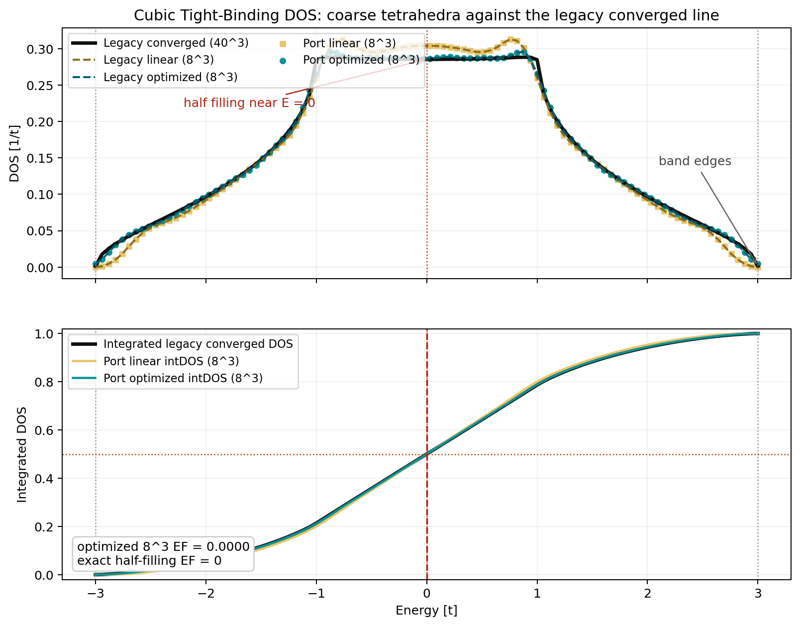
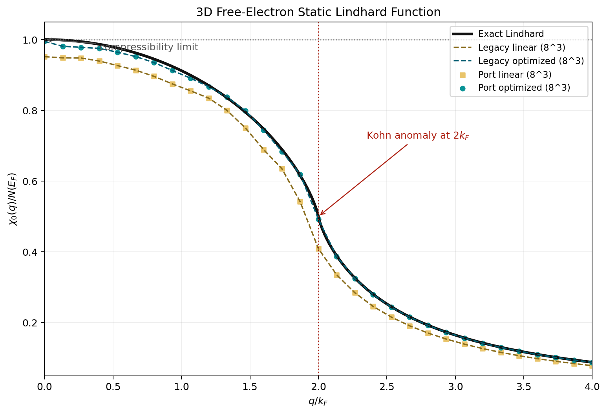
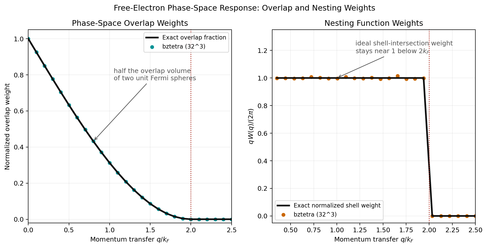
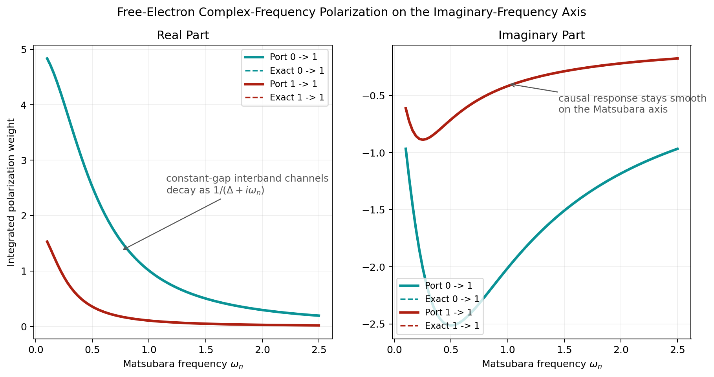

# Worked Examples

These are the examples that belong on a hosted documentation site: each one is
small enough to understand quickly, and each one produces a plot that tells you
whether the output looks physically sane.

Run plotting scripts from the repository root:

```bash
pip install -e '.[plot]'
```

## Density Of States In A Cubic Tight-Binding Band

This example uses `density_of_states_weights`,
`integrated_density_of_states_weights`, and `solve_fermi_energy` on the
single-band tight-binding model

\[
\varepsilon(\mathbf{k}) = -\cos k_x - \cos k_y - \cos k_z.
\]

Script:

```bash
python examples/plot_tight_binding_dos.py
```

Minimal pattern:

```python
import numpy as np
from bztetra import density_of_states_weights

bvec = np.eye(3)
energies = np.linspace(-3.0, 3.0, 100)
eigenvalues = build_cubic_tight_binding_band((8, 8, 8))

weights = density_of_states_weights(bvec, eigenvalues, energies)
dos_curve = weights.sum(axis=(1, 2, 3, 4))
```

<figure markdown>
  
  <figcaption>
    The coarse 8^3 tetrahedron result tracks the legacy DOS line shape and the
    integrated DOS shows the expected half-filling crossing near E = 0.
  </figcaption>
</figure>

## Static Lindhard Response

This example uses `static_polarization_weights` to reproduce the dimensionless
free-electron Lindhard curve

\[
\frac{\chi_0(q)}{N(E_F)}
=
\frac{1}{2}
+
\frac{1}{2q}
\left(1 - \frac{q^2}{4}\right)
\log\left|\frac{q+2}{q-2}\right|,
\]

with the known limits at \(q = 0\) and \(q = 2k_F\).

Script:

```bash
python examples/plot_lindhard.py
```

Minimal pattern:

```python
import numpy as np
from bztetra import static_polarization_weights

bvec, occupied, target = build_lindhard_bands((8, 8, 8), q_value=1.0)
weights = static_polarization_weights(bvec, occupied, target)
chi_q = 2.0 * weights.sum() * np.linalg.det(bvec) / (4.0 * np.pi)
```

<figure markdown>
  
  <figcaption>
    The optimized tetrahedron result reproduces both the compressibility limit
    at small q and the Kohn anomaly near 2k_F.
  </figcaption>
</figure>

## Phase-Space Overlap And Nesting

These two kernels are useful when you want geometry before full polarization:

\[
W_{\mathrm{overlap}}(\mathbf{q})
=
\int_{\mathrm{BZ}}
\Theta(-\varepsilon_{\mathbf{k}})
\Theta(\varepsilon_{\mathbf{k}} - \varepsilon_{\mathbf{k}+\mathbf{q}})\, d^3k,
\]

\[
W_{\mathrm{nest}}(\mathbf{q})
=
\int_{\mathrm{BZ}}
\delta(\varepsilon_{\mathbf{k}})
\delta(\varepsilon_{\mathbf{k}+\mathbf{q}})\, d^3k.
\]

Script:

```bash
python examples/plot_phase_space_and_nesting.py
```

<figure markdown>
  
  <figcaption>
    The overlap weight follows the legacy `dblstep` geometry, while the nesting
    weight isolates the Fermi-surface intersection geometry.
  </figcaption>
</figure>

## 2D Free-Electron Response

The 2D `bztetra.twod` path now has plot-first review scripts for the linear
triangle response kernels:

- `python examples/plot_twod_phase_space_overlap.py`
- `python examples/plot_twod_lindhard.py`

## Complex-Frequency Polarization On The Matsubara Axis

This example uses `complex_frequency_polarization_weights` for

\[
\Pi_0(\mathbf{q}, i\omega_n) =
\sum_{nm}\int_{\mathrm{BZ}}
\frac{
f(\varepsilon_n(\mathbf{k})) - f(\varepsilon_m(\mathbf{k}+\mathbf{q}))
}{
i\omega_n + \varepsilon_n(\mathbf{k}) - \varepsilon_m(\mathbf{k}+\mathbf{q})
}
\, d^3k.
\]

Script:

```bash
python examples/plot_complex_frequency_polarization.py
```

Minimal pattern:

```python
import numpy as np
from bztetra import complex_frequency_polarization_weights

energies = 1j * np.linspace(0.1, 2.5, 81)
weights = complex_frequency_polarization_weights(bvec, occupied, target, energies)
polarization = weights.sum(axis=(1, 2, 3)) * np.linalg.det(bvec)
```

<figure markdown>
  
  <figcaption>
    On the imaginary-frequency axis the response is smooth and the constant-gap
    channels decay with the expected \(1 / (\Delta + i\omega_n)\) structure.
  </figcaption>
</figure>

## More Scripts

- `python examples/review_occupancy.py`
- `python examples/review_dos.py`
- `python examples/plot_twod_square_lattice_dos.py`
- `python examples/plot_twod_phase_space_overlap.py`
- `python examples/plot_twod_lindhard.py`
- `python examples/plot_fermi_golden_rule.py`
- `python examples/review_geometry_and_cuts.py`
